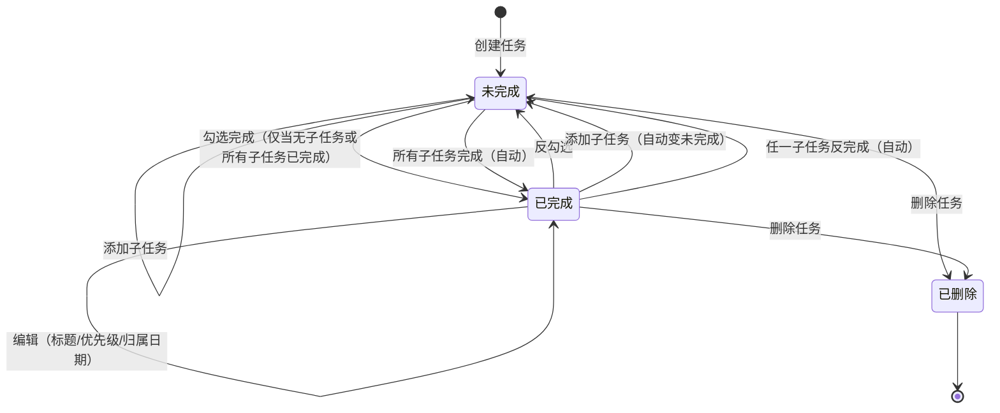
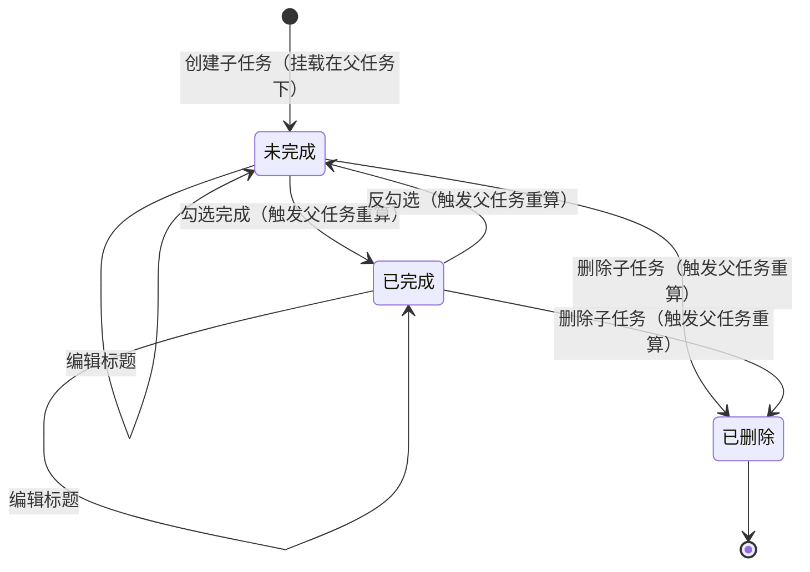
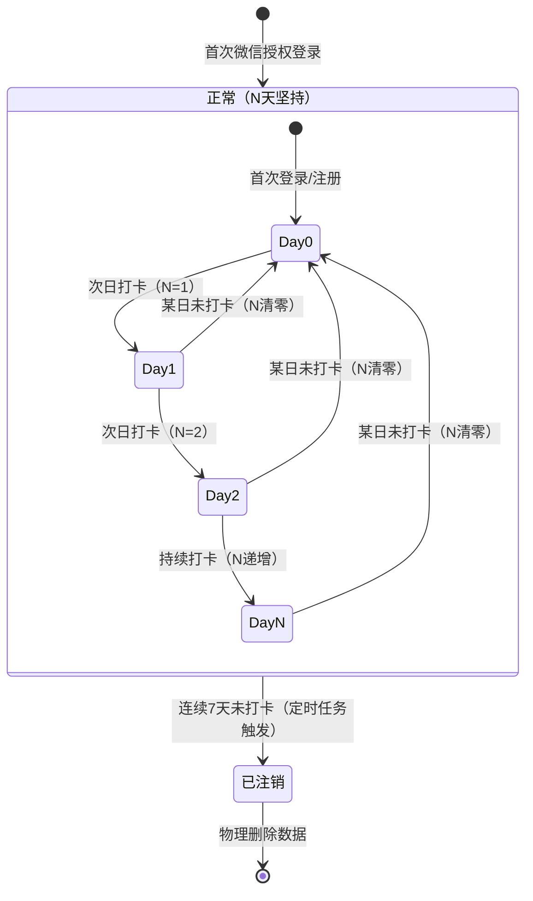
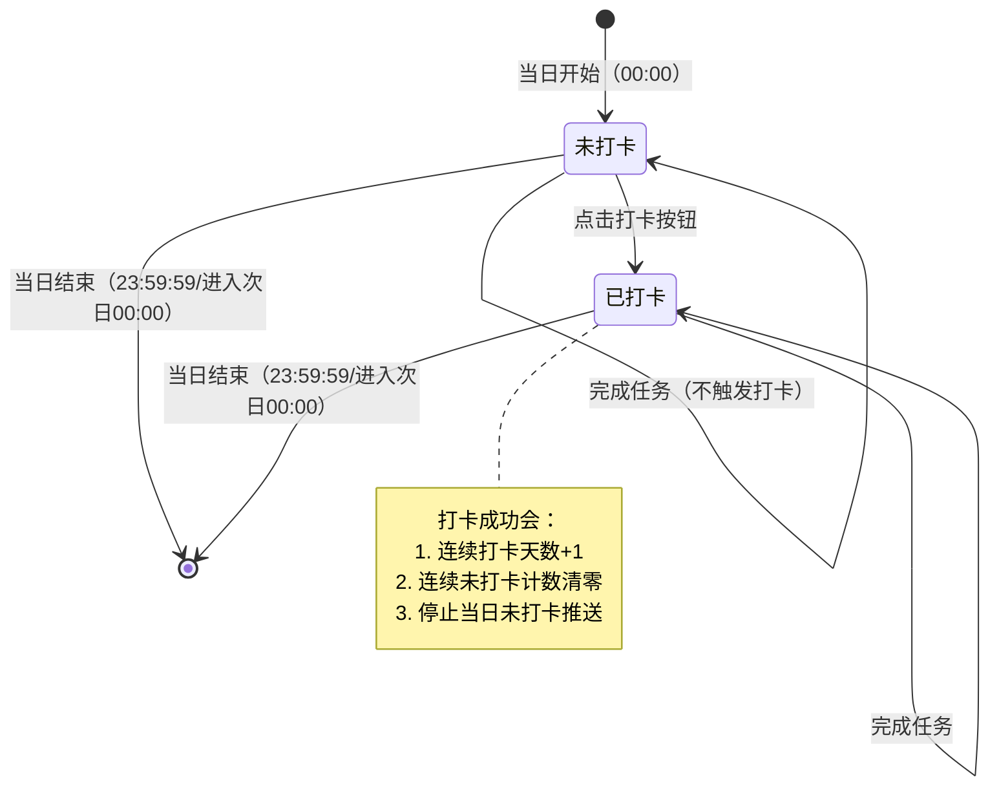
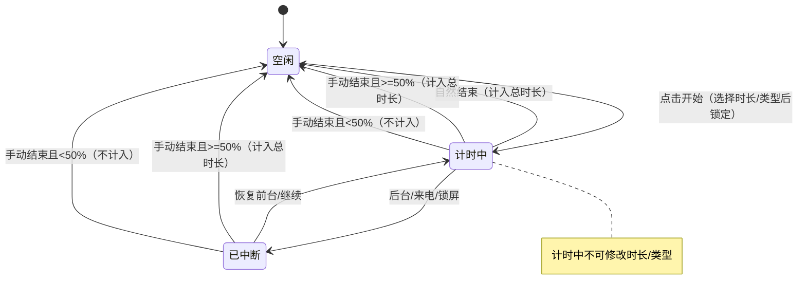
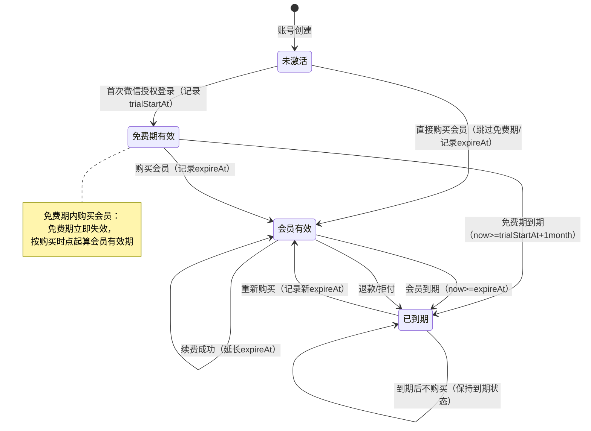
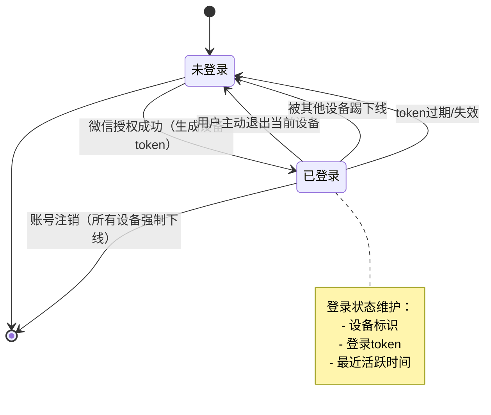

# 做计划 APP 产品需求文档（PRD v2.0）

## 📌 文档信息

| 项目 | 内容 |
|------|------|
| **产品名称** | 做计划 APP |
| **文档版本** | v2.0（落地版/可直接研发） |
| **编写日期** | 2026-01-27 |
| **依据材料** | 《做计划APP.pdf》（原始需求） `plan-app-prd-supplement.md`（歧义修复与状态机补全） |
| **约束说明** | 不新增模块/不推翻设计，仅对 4 模块（做计划/视图/专注/我的）补齐规则、边界、异常与状态机 |

---

## 📚 目录

1. [产品概述](#1-产品概述)
2. [全局口径（必须一致）](#2-全局口径必须一致)
3. [模块需求](#3-模块需求)
   - 3.1 [做计划模块](#31-做计划模块)
   - 3.2 [视图模块](#32-视图模块)
   - 3.3 [专注模块](#33-专注模块)
   - 3.4 [我的模块](#34-我的模块)
4. [异常与边界（落地必须覆盖）](#4-异常与边界落地必须覆盖)
5. [附录](#5-附录)
   - 5.1 [术语表](#51-术语表)
   - 5.2 [关键状态机](#52-关键状态机)

---

## 1. 产品概述

### 1.1 定位

这是一个偏「个人任务 / GTD + 四象限」的计划管理 APP，核心特点：
- 以"天"为主视角
- 任务用 P0 至 P3 四象限组织
- 强调长期坚持（打卡、连续天数）
- 弱项目、强执行

### 1.2 模块结构

总共 4 个模块：
- **做计划**：创建/管理任务、打卡
- **视图**：周/月视角监控待执行/逾期/已完成
- **专注**：倒计时番茄钟
- **我的**：个人信息、会员、设备管理

---

## 2. 全局口径（必须一致）

### 2.1 核心对象定义

| 对象 | 定义 | 关键属性 |
|------|------|----------|
| **任务（Todo）** | 归属某一"日期（归属日期）"与某一象限优先级（P0~P3），支持完成/未完成、可包含子任务、可设置重复 | `title`（标题） `date`（归属日期） `priority`（P0~P3） `status`（未完成/已完成） `createdAt`（创建时间） `completedAt`（完成时间） `deletedAt`（删除时间/逻辑删除） `repeatType`（重复类型：不重复/每日/每周/每月） `repeatConfig`（重复配置：如每周一三五/每月1号） `isRepeatInstance`（是否为重复任务副本） `repeatParentId`（重复任务源 ID） |
| **子任务（SubTodo）** | 必须挂载在某个父任务下，支持完成/未完成、可设置重复 | `title`（标题） `parentId`（父任务 ID） `status`（未完成/已完成） `repeatType`（重复类型：不重复/每日/每周/每月） `repeatConfig`（重复配置） `isRepeatInstance`（是否为重复子任务副本） `repeatParentId`（重复子任务源 ID） |
| **打卡（Check-in）** | **存在明确"打卡/完成今日计划"按钮，点击才算打卡**（影响坚持天数、7 天未打卡注销、未打卡推送） | `date`（打卡日期） `checkedAt`（打卡时间） `consecutiveDays`（连续天数） |
| **视图聚合（View Aggregation）** | 对任务按周/月范围、按状态（待执行/逾期/已完成）聚合展示 | - |
| **专注会话（Focus Session）** | 倒计时番茄钟会话，按规则计入总专注时间 | `duration`（时长/分钟） `type`（类型/固定枚举） `elapsedSeconds`（已完成秒数） `counted`（是否计入总时长） |
| **会员（Entitlement）** | **免费期**：非会员免费使用 1 个月，从**首次微信授权登录/注册**起算 **会员有效期**：购买成功后得到到期时间 | `trialStartAt`（免费期起算时间） `expireAt`（会员到期时间） `status`（未激活/免费期/会员有效/已到期） |
| **账号状态** | 未登录/已登录/已注销（Deactivated） | `deactivatedAt`（注销时间） `lastCheckInDate`（最近打卡日期） `consecutiveUncheckDays`（连续未打卡天数） |

### 2.2 任务状态与父子联动（强制规则）

- **父任务存在子任务时**：父任务完成状态由子任务派生：
  - 全部子任务完成 ⇒ 父任务完成
  - 任一子任务未完成 ⇒ 父任务未完成
  - 父任务完成后新增未完成子任务 ⇒ 父任务自动变为未完成
- **父任务不提供"绕过子任务的强制完成"**（避免口径分裂）

### 2.3 "完成态过滤"开关口径

- **完成态过滤开关含义**：
  - **开**：显示已完成任务（以删除线样式展示）
  - **关**：隐藏已完成任务
- **默认值**：开（显示删除线）
- **影响范围**：仅影响展示，不影响任务状态与统计

### 2.4 日历彩色小圆点口径

- 小圆点只反映【所选日期】归属的任务中，各象限是否存在**未完成**任务：
  - 例如所选日期存在未完成 P0 ⇒ 显示红色小点
- **逾期任务不并入所选日期小圆点**（逾期仅在视图模块展示）

### 2.5 逾期天数 N 的计算口径

- 以用户本地时区为准，按自然日计算
- 当 `today(00:00)` 超过任务归属日期的 `date(00:00)` 时视为逾期
- \(N = todayDate - taskDate\)，单位：天，整数

### 2.6 视图默认态与记忆

- **首次进入视图页默认**：周视图 + 待执行
- **用户切换后记忆上次选择**：下次进入保持上次周/月与状态 Tab
- 若无历史选择（首次安装/清缓存）：按默认进入

### 2.7 专注会话计入规则

- 倒计时自然结束 ⇒ 计入总专注时间
- 中途手动结束：
  - `< 50%`：不计入
  - `≥ 50%`（含等于）：计入已完成时长
- 计算使用秒：`elapsedSeconds / durationSeconds`；计入时长 = `elapsedSeconds`（自然结束则 = `durationSeconds`）
- **展示按小时向下取整**（例：3700s 展示 1h；小于 1 小时展示 0h）

### 2.8 多设备退出登录口径

- 设备列表中的【退出登录】：仅对所选"非当前设备"生效（吊销该设备 token）
- 页面底部【退出登录】主按钮：仅退出当前设备（吊销当前 token），不影响其他设备

### 2.9 7 天未打卡注销 + 推送

- **连续未打卡判定**：按用户本地时区自然日统计
  - 每天 00:00 结算昨日是否打卡
  - 昨日未打卡：连续未打卡计数 +1；一旦某日打卡则清零
- **连续未打卡达到 7 天**：账号置为 **Deactivated**（逻辑禁用），禁止再次登录与使用
- **未打卡提醒推送**：
  - 对"未注销且当日未打卡"的账号，每日仅推送 1 次
  - 默认发送窗口：20:00–21:00（可配置）
  - 账号进入 Deactivated 后停止所有未打卡提醒推送
- **注销后数据处理**：**仅做物理删除**（触发注销后执行），不支持恢复

---

## 3. 模块需求

## 3.1 做计划模块

### 3.1.1 页面结构

| 区域 | 内容 | 说明 |
|------|------|------|
| 左上 | 用户信息（头像、昵称） | 点击进入个人中心 |
| 左上 | 坚持天数统计：「已坚持做计划 N 天」 | 连续打卡天数，见 2.9 |
| 右上 | 完成态过滤开关 | 见 2.3 |
| 顶部 | 年/月/日 + 一周横向日历 | 可点击日期；当前选中高亮 |
| 顶部右侧 | **"返回今天"按钮** | **仅当选中非今日日期时显示** 点击后：日历自动选中今天，且任务列表切换到今天 |
| 日期下方 | 彩色小圆点 | 见 2.4 |
| 中间 | 四象限任务列表（P0/P1/P2/P3） | 见 3.1.2 |
| 底部 | 大号 "+" 浮动按钮 | 新增任务，见 3.1.4 |
| 底部/顶部 | "打卡/完成今日计划"按钮 | 位置由 UI 决定，见 3.1.6 |

### 3.1.2 四象限定义

| 象限 | 含义 | 颜色示例 |
|------|------|----------|
| **P0** | 紧急且重要（现在不做就要出事） | 红色 |
| **P1** | 重要不紧急（不做会后悔） | 橙色 |
| **P2** | 紧急不重要（快速处理，别投入） | 黄色 |
| **P3** | 不重要不紧急（能删就删） | 绿色 |

### 3.1.3 任务展示与交互

#### 任务卡片组成
- 任务名称
- 左侧圆形勾选按钮：点击切换完成/未完成
- 已完成展示删除线（若完成态过滤开=显示）

#### 排序规则
- 同一象限内排序：**创建时间升序**（早创建的在前）

#### 子任务
- 展示在父任务下方（可折叠/展开）
- 子任务可勾选完成/反完成
- 父子联动按 2.2 执行

#### 字段约束
| 字段 | 约束 |
|------|------|
| 任务标题 | 必填，1-100 字符，支持 emoji |
| 子任务标题 | 必填，1-50 字符，支持 emoji |
| 归属日期 | 必填，不可早于"今天-365天"（历史 1 年）；不可晚于"今天+365天"（未来 1 年） |
| 子任务数量 | 单个任务下最多 20 个子任务 |

### 3.1.4 新增与编辑

#### 新增任务（浮层交互）

**触发入口**：底部"+"浮动按钮

**交互流程**：
1. 点击"+"按钮 → 从底部弹出浮层（半屏/全屏由 UI 决定，建议半屏）
2. 浮层自动获取焦点到"任务标题"输入框

**浮层内容**：

| 字段 | 类型 | 说明 | 默认值 |
|------|------|------|--------|
| **任务标题** | 文本输入框 | 必填，1-100 字符，支持 emoji placeholder："输入任务名称" | 空 |
| **归属日期** | 只读文本（不可编辑） | 显示当前日历选中的日期 格式："2026-01-27（今天）" / "2026-01-28（明天）" | **自动使用日历当前选中日期** 若选中的是历史日期（< today），则自动改为 today |
| **象限选择** | 单选按钮组（4 个选项） | P0 / P1 / P2 / P3 每个选项展示颜色标识与含义 （如：P0 红色"紧急且重要"） | P1 |
| **重复设置** | 可选开关 + 选择器 | 见下方"重复设置规则" | 不重复 |
| **底部按钮** | 操作区 | "取消" / "保存" | - |

**交互细节**：
- **日期逻辑**：
  - 归属日期**直接读取日历当前选中的日期**，用户无需手动选择
  - **若选中的是历史日期**（< today），则自动改为 today，并在浮层顶部显示提示："已自动调整为今天"
  - **日期不可编辑**：用户若需修改归属日期，需先关闭浮层 → 点击日历切换日期 → 重新点击"+"
- **象限选择**：
  - 4 个单选按钮横向排列（或 2x2 宫格）
  - 每个选项显示：象限标签（如 P0）+ 颜色圆点 + 含义文字（如"紧急且重要"）
  - 默认选中 P1
- **重复设置**（见下方详细规则）：
  - 默认关闭（不重复）
  - 打开开关后，展开重复选项（每日/每周/每月）
- **保存逻辑**：
  - 点击"保存" → 校验任务标题（不为空 且 长度 1-100）
  - 校验通过 → 创建任务（若设置了重复，自动生成重复任务）→ 关闭浮层 → 任务出现在对应象限区域
  - 校验失败 → toast 提示"请输入任务名称"
- **取消逻辑**：
  - 点击"取消" / 点击浮层外区域（蒙层） / 返回键 → 关闭浮层，不保存

**重复设置规则**：

| 重复类型 | 配置项 | 生成规则 | 示例 |
|----------|--------|----------|------|
| **不重复** | - | 仅创建当日任务 | - |
| **每日重复** | 无需额外配置 | 从当前归属日期起，**每天**自动生成一个任务副本（未来 365 天） | 设置"早起跑步"每日重复 → 明天/后天…每天都自动生成一个"早起跑步"任务 |
| **每周重复** | 选择星期几 （多选，如周一/周三/周五） | 从当前归属日期起，**每周**在指定星期自动生成任务副本（未来 52 周） | 设置"团队会议"每周一/周三重复 → 下周一/下周三…每周一三都生成任务 |
| **每月重复** | 选择几号 （单选，如每月 1 号） | 从当前归属日期起，**每月**在指定日期自动生成任务副本（未来 12 个月） | 设置"还信用卡"每月 1 号重复 → 下个月 1 号/下下个月 1 号…都生成任务 |

**重复任务特性**：
- **自动生成**：创建重复任务后，系统自动在未来日期生成任务副本（不占用当前任务数上限）
- **独立管理**：每个副本都是独立任务，可单独完成/编辑/删除
- **标识**：重复任务在任务卡片右上角显示"🔁"标识
- **停止重复**：
  - 方式 1：编辑任务 → 关闭"重复设置"开关 → 保存（仅影响未来副本，已生成的副本不受影响）
  - 方式 2：删除任务 → 二次确认"是否删除所有重复任务？"（包含已生成的所有副本）
- **修改重复规则**：编辑任务 → 修改重复类型/配置 → 保存（仅影响未来副本，已生成的副本不受影响）

**字段约束**：
- 重复任务的**归属日期范围**：从当前日期起，最多生成未来 365 天的副本
- 重复任务**总数上限**：单个重复任务最多生成 365 个副本（防止数据量过大）

**示例**：
- 用户在日历上选中"01-28（明天）" → 点击"+" → 浮层显示"归属日期：2026-01-28（明天）"
- 用户在日历上选中"01-25（历史）" → 点击"+" → 浮层显示"归属日期：2026-01-27（今天）" + 顶部提示"已自动调整为今天"
- 用户创建"早起跑步"任务 → 打开"重复设置" → 选择"每日重复" → 保存 → 系统自动在未来 365 天每天生成一个"早起跑步"任务

---

#### 新增子任务（浮层交互）

**触发入口**：
1. 在父任务卡片上**长按** / **右滑**露出"新增子任务"按钮
2. 或点击父任务进入"任务详情页" → 点击"新增子任务"按钮

**交互流程**：
1. 点击"新增子任务" → 从底部弹出浮层
2. 浮层自动获取焦点到"子任务标题"输入框

**浮层内容**：

| 字段 | 类型 | 说明 | 默认值 |
|------|------|------|--------|
| **父任务** | 只读文本 | 显示父任务标题（灰色小字） | 自动关联 |
| **子任务标题** | 文本输入框 | 必填，1-50 字符，支持 emoji placeholder："输入子任务名称" | 空 |
| **重复设置** | 可选开关 + 选择器 | 同任务的重复设置规则（见上方） | 继承父任务的重复设置 |
| **底部按钮** | 操作区 | "取消" / "保存" | - |

**交互细节**：
- **父任务关联**：子任务自动挂载在当前父任务下，不可修改
- **归属日期**：子任务继承父任务的归属日期，不可单独设置
- **象限**：子任务继承父任务的象限，不可单独设置
- **重复设置**：
  - **默认继承父任务的重复设置**（若父任务设置了每日重复，子任务也默认每日重复）
  - 用户可单独修改子任务的重复设置（不影响父任务）
- **保存逻辑**：
  - 点击"保存" → 校验子任务标题（不为空 且 长度 1-50）
  - 校验通过 → 创建子任务（若设置了重复，自动生成重复子任务）→ 关闭浮层 → 子任务出现在父任务下方
  - 校验失败 → toast 提示"请输入子任务名称"
- **数量限制**：
  - 若父任务下已有 20 个子任务 → 点击"新增子任务"时 toast 提示"子任务数已达上限（20 条）"，不弹出浮层

---

#### 编辑任务（浮层交互）

**触发入口**：
1. 点击任务卡片 → 进入"任务详情页" → 点击"编辑"按钮
2. 或在任务卡片上**右滑**露出"编辑"按钮

**交互流程**：
1. 点击"编辑" → 从底部弹出浮层（与新增任务浮层一致）
2. 浮层自动填充当前任务信息

**浮层内容**：

| 字段 | 类型 | 说明 | 默认值 |
|------|------|------|--------|
| **任务标题** | 文本输入框 | 必填，1-100 字符 | 当前任务标题 |
| **归属日期** | 日期选择器（可编辑） | 点击展开日期选择器 受字段约束限制（历史 1 年/未来 1 年） | 当前归属日期 |
| **象限选择** | 单选按钮组 | P0 / P1 / P2 / P3 | 当前象限 |
| **重复设置** | 可选开关 + 选择器 | 见"重复设置规则" | 当前重复设置 |
| **底部按钮** | 操作区 | "取消" / "保存" / "删除"（红色） | - |

**交互细节**：
- **归属日期可编辑**：点击日期字段 → 展开日期选择器（日历组件）→ 选择日期 → 自动关闭选择器
  - **支持跨日修改**，但受字段约束限制（历史 1 年/未来 1 年）
- **删除按钮**：点击"删除" → 二次确认弹窗"确认删除该任务？" → 确认 → 删除任务 → 关闭浮层
- **保存逻辑**：
  - 点击"保存" → 校验字段 → 更新任务 → 关闭浮层
  - 若修改了归属日期 → 任务移动到新日期的对应象限

---

#### 编辑子任务（浮层交互）

**触发入口**：
1. 点击子任务 → 弹出浮层
2. 或在子任务上**右滑**露出"编辑"按钮

**浮层内容**：

| 字段 | 类型 | 说明 | 默认值 |
|------|------|------|--------|
| **父任务** | 只读文本 | 显示父任务标题 | 自动关联 |
| **子任务标题** | 文本输入框 | 必填，1-50 字符 | 当前子任务标题 |
| **重复设置** | 可选开关 + 选择器 | 见"重复设置规则" | 当前重复设置 |
| **底部按钮** | 操作区 | "取消" / "保存" / "删除"（红色） | - |

**交互细节**：
- **不可修改归属日期/象限**：子任务继承父任务，不可单独修改
- **删除逻辑**：点击"删除" → 二次确认 → 删除子任务 → 触发父任务状态重算（见 2.2）

---

#### 快捷新增（优化操作）

**长按"+"按钮** → 弹出快捷菜单（底部弹出式菜单）：

**菜单选项**：

| 选项 | 说明 | 操作 |
|------|------|------|
| **新建任务（P0）** | 快速创建 P0 任务 | 点击后弹出新增任务浮层，象限默认选中 P0 |
| **新建任务（P1）** | 快速创建 P1 任务 | 点击后弹出新增任务浮层，象限默认选中 P1 |
| **新建任务（P2）** | 快速创建 P2 任务 | 点击后弹出新增任务浮层，象限默认选中 P2 |
| **新建任务（P3）** | 快速创建 P3 任务 | 点击后弹出新增任务浮层，象限默认选中 P3 |
| **快速添加子任务** | 为某个父任务快速添加子任务 | 点击后弹出"选择父任务"列表 → 选择父任务 → 弹出新增子任务浮层 |
| 取消 | 关闭菜单 | - |

**快速添加子任务流程**：
1. 长按"+"按钮 → 点击"快速添加子任务"
2. 弹出"选择父任务"列表（仅显示当前选中日期的任务）
   - 列表字段：任务标题、象限标识、子任务数（如"3/20"）
   - 排序：按象限 P0→P3，同象限内按创建时间升序
   - 空态：若当前日期无任务 → toast 提示"今天还没有任务，请先创建任务"
3. 点击某个父任务 → 弹出新增子任务浮层（自动关联该父任务）
4. 输入子任务标题 → 保存 → 子任务出现在父任务下方

**交互细节**：
- **长按时长**：长按 0.5 秒触发
- **菜单展示**：从底部弹出（类似系统分享菜单）
- **颜色标识**：每个象限选项前显示对应颜色圆点（P0 红色、P1 橙色等）

### 3.1.5 删除

- **删除任务/子任务**：进入 Deleted（逻辑删除）状态，默认不展示
- **回收站**：本版本不新增回收站功能
- **多端一致性**：删除必须有 `deletedAt` 字段，避免并发冲突

### 3.1.6 打卡入口

- **按钮位置**：页面提供"打卡/完成今日计划"按钮（位置由 UI 决定，建议顶部或底部固定）
- **打卡规则**：点击才算打卡（与完成任务解耦，见 2.1/2.9）
- **幂等性**：当日重复打卡无副作用（见状态机 5.4）

### 3.1.7 返回今天（快捷导航）

**触发条件**：
- **仅当日历选中的日期 ≠ 今天时显示**
- 按钮位置：日历右侧或顶部右上角（建议：年/月/日显示区域右侧）

**按钮样式**：
- 文案："今天" / "返回今天"
- 样式：小按钮（不影响日历主体）
- 建议图标：📅 或 ⏺（圆点图标）

**点击行为**：
1. 点击"返回今天"按钮
2. 日历自动切换到今天（高亮显示）
3. 任务列表自动刷新为今天的四象限任务
4. 按钮自动隐藏（因为当前选中 = 今天）

**交互细节**：
- **显示逻辑**：监听日历选中日期变化，当 `selectedDate ≠ today` 时显示按钮
- **隐藏逻辑**：当 `selectedDate === today` 时隐藏按钮
- **动画**：按钮显示/隐藏时增加淡入淡出动画（300ms）

**示例**：
- 用户在日历上选中"01-28（明天）" → 顶部右侧出现"返回今天"按钮
- 用户点击"返回今天" → 日历自动选中"01-27（今天）" → 按钮自动隐藏

### 3.1.8 空态与异常

| 场景 | 文案 | 引导操作 |
|------|------|----------|
| 所选日期无任务 | "今天还没有计划哦~\n点击下方 + 号快速添加" | 高亮底部"+"按钮 |
| 某象限无任务 | 不显示该象限区域（折叠） | - |
| 网络错误 | "网络连接失败，请稍后重试" | 提供"重试"按钮 |
| 新增任务失败 | "保存失败，请重试" | 保留用户输入内容，提供"重试"按钮 |

---

## 3.2 视图模块

### 3.2.1 目标

视图 = 执行监控：
- 看当下要做什么
- 看哪里逾期了
- 看已经完成了什么

### 3.2.2 页面结构

| 区域 | 内容 | 说明 |
|------|------|------|
| 顶部 | 页面标题（本月/本周） | 动态显示当前选择 |
| 顶部切换 | 时间维度：[周 \| 月] | 见 2.6 |
| 顶部切换 | 状态切换：[待执行 \| 逾期 \| 已完成] | 见 3.2.4-3.2.6 |
| 内容区 | 任务列表（按天分组） | 见下方规则 |

### 3.2.3 默认态与记忆

见 2.6（首次默认"周 + 待执行"，且记忆用户上次选择）。

### 3.2.4 待执行 Tab 规则

#### 纳入条件
- 未完成 **且** 归属日期 ≥ today

#### 分组标题
- **周视图**：使用相对标题（今天/明天/后天…）
- **月视图**：使用绝对日期标题（如 01-27）

#### 排序
1. 先按归属日期升序
2. 同日内按优先级：P0 → P3
3. 同优先级内按创建时间升序

#### 空态
- 文案："暂无待执行任务，真棒！"

### 3.2.5 逾期 Tab 规则

#### 纳入条件
- 未完成 **且** 归属日期 < today

#### 显示
- 每条必须显示「已逾期 N 天」（N 计算见 2.5）

#### 排序（明确产品意图"越逾期越靠前"）
1. 按归属日期升序（日期越早越靠前）
2. 同日内按优先级：P0 → P3
3. 同优先级内按创建时间升序

#### 空态
- 文案："太棒了！没有逾期任务"

### 3.2.6 已完成 Tab 规则

#### 纳入条件
- 已完成

#### 排序
1. 按完成时间降序（最近完成的在前）
2. 同日内按优先级：P0 → P3
3. 同优先级内按创建时间降序

#### 空态
- 文案："暂无已完成任务\n完成任务后会在这里看到哦~"

### 3.2.7 范围边界（周/月）

- **仅展示当前周/当前月范围内任务**
- **范围外任务不在该视图出现**
- **逾期任务展示规则**：
  - 逾期任务的"归属日期"如果**落在当前周/月范围内**，则显示在逾期 Tab
  - 逾期任务的"归属日期"如果**不在当前周/月范围内**，则不显示
  - **不做"把所有历史逾期都塞进本周/本月"的合并逻辑**

#### 示例（当前周：2026-01-26 ~ 2026-02-01）
- 任务 A：归属日期 2026-01-25（逾期），**不显示**（不在本周范围）
- 任务 B：归属日期 2026-01-26（逾期），**显示**在逾期 Tab
- 任务 C：归属日期 2026-01-27（待执行），**显示**在待执行 Tab

---

## 3.3 专注模块

### 3.3.1 产品定位

专注 = 一个纯倒计时的番茄钟，用来开始，不用来复盘。

### 3.3.2 页面结构

| 区域 | 内容 | 说明 |
|------|------|------|
| 左上 | 总专注时间 | 固定展示，不可点、不可展开、不展示记录明细 |
| 中间 | 倒计时圆盘 | 显示剩余时间 |
| 下方 | 开始/结束按钮 | 状态见 5.5 |
| 右侧（或顶部） | 专注任务类型选择 | 见 3.3.4 |

### 3.3.3 时长选择

- **默认**：25 分钟
- **固定可选时长**：15 / 25 / 30 / 45 / 60（分钟）
- **不支持自定义分钟**，不支持正计时
- **参数锁定**：仅在未开始（Idle）可选择时长；**计时中不可修改**（见 2.7）

### 3.3.4 类型选择

- **固定内置类型**（示例）：工作/学习/阅读/编程/运动/冥想/其它
- **只能选一个**
- **不支持新增/编辑**
- **仅用于统计总时长**（不做记录列表）

### 3.3.5 结束与计入规则

严格按 2.7 执行（自然结束计入；手动结束按 50% 阈值计入/不计入）。

### 3.3.6 异常场景

| 场景 | 处理 |
|------|------|
| 计时中后台（锁屏/切到其他 App） | 进入"已中断"状态（见状态机 5.5）；**后台继续计时**（倒计时不暂停） |
| 计时中来电 | 同上 |
| 恢复前台 | 从"已中断"恢复到"计时中" |
| App 被杀进程（强制关闭） | 会话丢失，**不计入总时长** |

---

## 3.4 我的模块

### 3.4.1 用户信息（个人中心）

#### 展示
- 头像
- 昵称
- 用户 ID（不可修改）
- IP 属地（自动获取/展示，不可修改）

#### 编辑
| 字段 | 规则 |
|------|------|
| 头像 | 仅可使用系统提供头像（预设 10-20 个头像供选择） |
| 昵称 | 允许修改；1-20 字符；不允许违规词；**限制：7 天内最多修改 2 次** |

### 3.4.2 权益 / 充值（会员）

#### 展示
- 当前权益状态（会员 / 非会员）
- 会员到期时间
- **非会员免费使用一个月**（口径见 2.1 免费期定义）

#### 充值方案
- **月**：¥12/月
- **季**：¥30/季（优惠 ¥6）
- **年**：¥108/年（优惠 ¥36）

**注**：具体价格由运营/商务确定，此处仅示例。

#### 续费规则（落地口径）
- **会员为非自动续费**：用户每次手动购买生效
- **若当前已是会员**：在 `expireAt` 基础上顺延对应时长
- **若已过期**：从购买成功时间起算新的 `expireAt`
- **支付回调需幂等**：同一订单多次回调仅生效一次

#### 支付异常处理

| 场景 | 处理 |
|------|------|
| 支付中（用户未完成支付） | 显示"支付处理中"；轮询订单状态（最多 60s） |
| 支付失败 | toast 提示"支付失败，请重试"；不修改会员状态 |
| 掉单（用户已支付但回调未到） | 提供"恢复购买"按钮（iOS）或"同步订单"（Android/小程序） |
| 退款/拒付 | 会员立即到期（见状态机 5.6） |

### 3.4.3 多设备登录管理

#### 我的设备
- **当前设备**（标记，仅展示，不可操作）
- **其他设备列表**

#### 每个设备展示
- 设备名称（如 iPhone / iPad）
- 最近一次登录 IP
- 最近登录时间
- 状态标识（当前/非当前）

#### 支持操作
- **非当前设备**：【退出登录】（仅该设备退出，见 2.8）
- **底部主按钮**：【退出登录】（仅当前设备退出，见 2.8）

#### 设备数量限制
- **同时登录设备数上限**：10 台
- **超出限制**：提示"设备数量已达上限，请先退出其他设备"

### 3.4.4 登录机制与注销

#### 登录
- **唯一登录方式**：微信授权登录
- **微信授权失败场景**：

| 场景 | 处理 |
|------|------|
| 用户拒绝授权 | toast 提示"需要微信授权才能使用"；停留在登录页 |
| 用户取消授权 | 同上 |
| 授权接口超时 | toast 提示"网络超时，请重试"；提供"重新授权"按钮 |
| 微信未安装（仅移动端） | 提示"请先安装微信"；提供跳转应用市场入口 |

#### 注销
- 注销机制：见 2.9（7 天未打卡 => Deactivated）

---

## 4. 异常与边界（落地必须覆盖）

### 4.1 幂等与并发（多端一致性）

| 操作 | 冲突解决方案 |
|------|--------------|
| 勾选完成/反完成 | 同一任务的并发写入，以"最后写入时间戳/版本号"解决冲突（具体方案由研发选型） |
| 删除/踢下线 | 幂等（重复请求不应报错或产生二次副作用） |
| 支付回调 | 订单幂等（同一订单号仅生效一次） |
| 打卡 | 幂等（当日重复打卡无副作用） |

### 4.2 时间与时区

- 逾期计算、7 天游标等一律以**用户本地时区**自然日为准
- 每天 00:00 结算昨日打卡与连续未打卡计数
- **服务端存储**：建议使用 UTC 时间戳，客户端展示时转换为本地时区

### 4.3 专注中断（后台/来电/锁屏）

- 专注会话状态允许进入 `Interrupted` 并可 `Resume`
- **后台计时策略**：**后台继续计时**（倒计时不暂停）
- **App 被杀进程**：会话丢失，不计入总时长

### 4.4 网络异常与限流

| 场景 | 处理 |
|------|------|
| 网络断开（离线） | toast 提示"网络连接失败"；**本地缓存任务变更**，网络恢复后同步 |
| 接口超时（> 10s） | toast 提示"请求超时，请重试"；提供"重试"按钮 |
| 服务端限流（429） | toast 提示"操作过于频繁，请稍后再试"；**客户端加防抖（1s）** |
| 服务端错误（500） | toast 提示"服务异常，请稍后重试" |

### 4.5 数据量限制

| 项目 | 上限 | 超出提示 |
|------|------|----------|
| 单日任务数 | 50 条（不含重复任务副本） | "今日任务数已达上限（50 条），请完成后再创建" |
| 单任务子任务数 | 20 条 | "子任务数已达上限（20 条）" |
| 重复任务副本数 | 单个重复任务最多生成 365 个副本 | "重复任务副本数已达上限（365 条）" |
| 设备数 | 10 台 | "设备数量已达上限，请先退出其他设备" |
| 昵称修改频率 | 7 天内 2 次 | "昵称修改过于频繁，请 X 天后再试" |

### 4.6 重复任务异常处理

| 场景 | 处理 |
|------|------|
| 重复任务生成失败（服务端异常） | toast 提示"重复任务生成失败，请稍后重试"；任务本身创建成功，但不生成副本 |
| 副本数量达到上限（365 条） | toast 提示"重复任务副本数已达上限（365 条）"；停止生成新副本 |
| 删除重复任务源 | 弹窗二次确认："是否删除所有重复任务（含未来副本）？" • 确认 → 删除源任务 + 所有未完成副本 • 取消 → 仅删除当前任务（不影响副本） |
| 修改重复规则 | 仅影响未来副本（已生成的副本保持原样）；toast 提示"修改仅对未来副本生效" |
| 重复任务副本生成冲突（同一天已有同名任务） | 自动在标题后添加序号（如"早起跑步 (2)"） |

---

## 5. 附录

## 5.1 术语表

| 术语 | 定义 |
|------|------|
| **归属日期** | 任务所属的日期（天视角），用于日历展示与视图聚合 |
| **完成态过滤** | 控制已完成任务是否展示的开关（开=显示删除线；关=隐藏） |
| **打卡** | 点击"打卡/完成今日计划"按钮的行为，**不等于**完成任务 |
| **坚持天数** | 连续打卡的自然日天数 |
| **逾期** | 任务归属日期 < 今天，且未完成 |
| **计入** | 专注会话完成后，累加到"总专注时间" |
| **免费期** | 非会员免费使用 1 个月，从首次微信授权登录起算 |
| **已注销（Deactivated）** | 连续 7 天未打卡后账号被逻辑禁用，无法再登录 |
| **重复任务** | 设置了重复规则的任务，系统自动在未来日期生成任务副本（最多 365 天） |
| **重复任务副本** | 由重复任务源自动生成的任务实例，可独立完成/编辑/删除 |

---

## 5.2 关键状态机

### 5.2.1 任务状态机（父任务）

**说明**：父任务存在子任务时，完成状态由子任务派生（见 2.2）。

### 5.2.2 子任务状态机

**说明**：子任务完成/反完成会自动触发父任务状态联动（见 2.2）。

### 5.2.3 账号状态机（包含打卡与注销）

**说明**：账号状态由连续打卡天数驱动（见 2.9）；每日打卡状态见下方流程图。

### 5.2.4 每日打卡状态（单日视角）

**说明**：完成任务不等于打卡；仅点击"打卡/完成今日计划"按钮才算打卡（见 2.1）。

### 5.2.5 专注会话状态机

**说明**：计入规则见 2.7（自然结束计入；手动结束按 50% 阈值判定）。

### 5.2.6 会员权益状态机

**说明**：免费期从首次登录起算 1 个月；续费叠加到期时间；支付幂等（见 3.4.2）。

### 5.2.7 设备登录会话状态机

**说明**：单个设备的登录会话状态；多设备管理见 2.8。

---

## 📝 变更记录

| 版本 | 日期 | 变更内容 | 修订人 |
|------|------|----------|--------|
| v1.0 | 2026-01-27 | 初稿（基于原 PDF + 歧义修复） | - |
| v2.0 | 2026-01-27 | 补齐功能边界/异常场景/字段约束；修复歧义；优化排版 | AI 产品助理 |

---

**文档结束**
